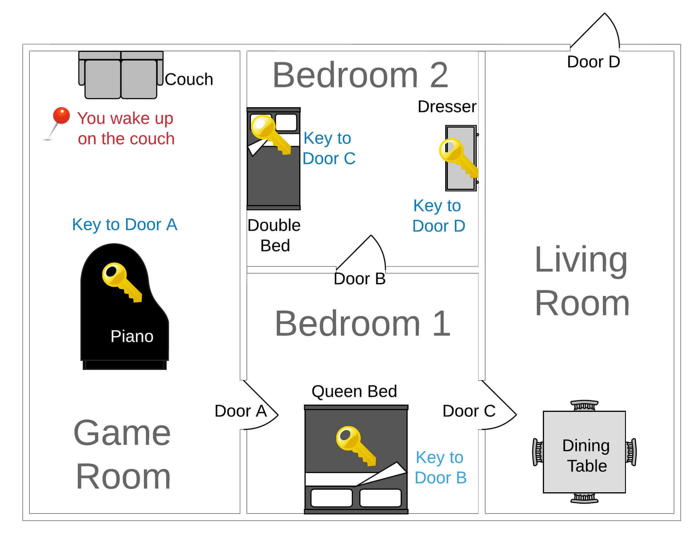

# Escape_room_quest_one

# :video_game: Overview
The Escape Room game challenges players to think critically and solve problems using clues found in the rooms. It's a mix of adventure and puzzle-solving in a fun, virtual environment. The goal is to escape before it's too late!

# :hammer_and_wrench: Features
1. Interactive gameplay with user input
2. Logical puzzles and challenges
3. Multiple rooms with hidden items and clues
4. Game state tracking and multiple gameplay sessions

# :old_key: Technologies Used
The project leverages fundamental Python concepts - see below

# :star2: Functions:
Organize code into reusable blocks.

# :memo: Data Structures:
1. Sets
2. Lists
3. Dictionaries (including nested dictionaries) - Used to model rooms, items, and interactions.

# :jigsaw: Control Flow:
1. If & else statements: Create conditional logic for game events.
2. User Input: Capture player decisions and actions.

# Presentation PPT: 
https://docs.google.com/presentation/d/1hBqzLGJJUXtxghBi3_8Uux6m6B02frE2tC5otyhGCpo/edit?slide=id.p#slide=id.p
